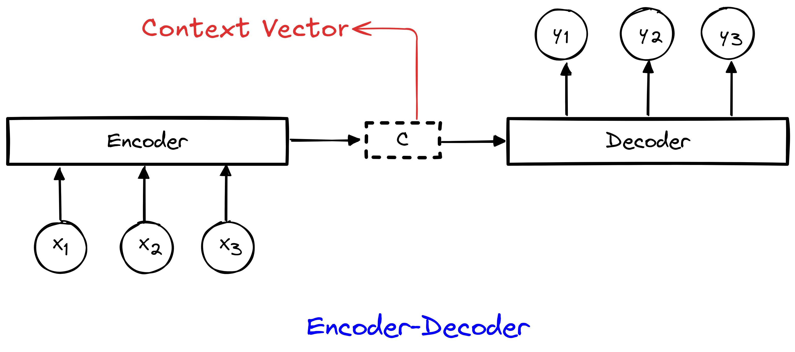

# EncoderDecoder

This is a simple encoder-decoder model that can be used to encode and decode data using 
MultiLayer Perceptron (MLP) network. The main purpose of this model is to extract
the context vector from the encoder to be used as new data representation.

 

## Notebooks
- [Encoder-Decoder notebook using dummy dataset](notebooks/EncoderDecoder.ipynb)  <a target="_blank" href="https://colab.research.google.com/github/https://colab.research.google.com/drive/1oTpOUHhTjohmLELwcs4zNBigT0y-FFYc">
  
</a>
- [EncoderDecoder-IrisExample](notebooks/EncoderDecoder-Example.ipynb) <a target="_blank" href="https://colab.research.google.com/github/https://colab.research.google.com/drive/1PocPv3cQv8wLRkR5w1We4iwxKgfm5Eo5">
  
</a>

## Installation
```bash
chmod +x install.sh
./install.sh
```

## Usage
```bash
./run.sh

# or

python app.py
```

## Author
- [Olavo Barros](olavo.barros@ufv.br)

